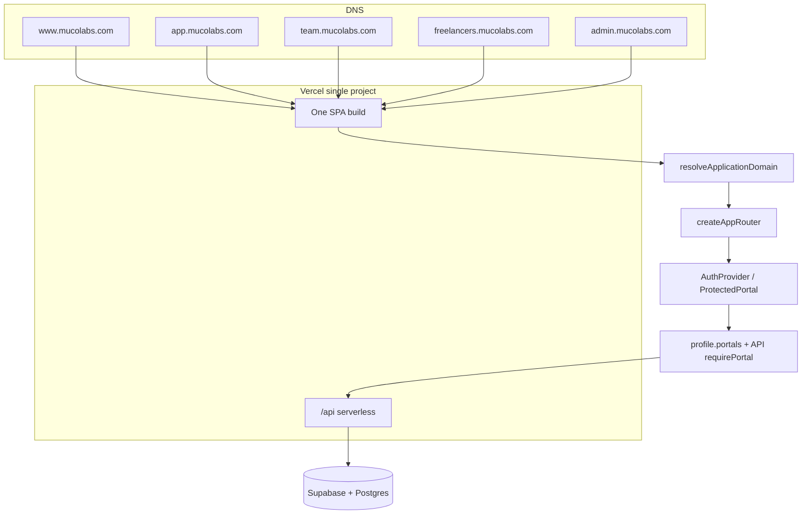

# PHASE 4.43 — Modular Domain Portal Architecture & Vercel Subdomain Readiness (MASTER 16)

**Date:** 2026-08-09  
**Verdict:** **READY WITH LIMITATIONS** (domain resolver + routing shipped; physical `src/app/{domain}` tree is phased)  
**DNS / production subdomains:** **EXTERNAL CONFIGURATION REQUIRED** (not activated in this master)

---

## 1. Executive summary

MASTER 16 establishes a **single-repo modular monolith** with a **central domain configuration layer**, **hostname → application domain resolution**, **subdomain-root vs path-prefix routing**, **legacy www portal path redirects**, **domain/portal mismatch enforcement**, and **post-auth URLs aligned to portal origins**. The goal is **one Vercel project, one API, one Supabase project** with clear **PUBLIC / CUSTOMER / EMPLOYEE / FREELANCER / ADMIN** boundaries at the **routing and configuration** level first; large-scale file moves are **deferred** to avoid breaking imports and RBAC.

**Preserved:** Server `requirePortal` / permissions, freelancer `approvalStatus`, customer isolation, existing path-prefix dev/staging (`localhost`, `muco-v1.vercel.app`).

**Not claimed:** Production DNS cutover, live multi-subdomain browser E2E with real sessions, or completion of physical `src/features/{domain}` reorganization.

---

## 2. Current architecture (before MASTER 16)

```
User → single origin (www or path-prefix)
     → React Router (/app, /team, /admin, /app/freelancer under MainLayout)
     → ProtectedPortal (session + profile.portals)
     → API /api/v1/* (authenticate + requirePortal)
     → Supabase + Postgres
```

Portal URLs on production marketing host were **path-based** (`www.mucolabs.com/app`, `/team`, `/admin`), which conflicts with the target **subdomain-as-portal** model.

---

## 3. Target architecture (after MASTER 16)

```
DNS (multiple hostnames → one Vercel project)
  ↓
SPA (same build artifact)
  ↓
resolveApplicationDomain(hostname)
  ↓
resolveRoutingMode → path_prefix | subdomain_root
  ↓
createAppRouter() → path-prefix tree | portal-root tree
  ↓
ProtectedPortal + DomainPortalEnforcer
  ↓
API (authoritative RBAC)
```

**Production intent:**

| Host | Application domain | User-facing portal |
|------|-------------------|-------------------|
| www.mucolabs.com | public | Marketing |
| app.mucolabs.com | customer | Customer (routes at `/`) |
| team.mucolabs.com | employee | Employee |
| freelancers.mucolabs.com | freelancer | Freelancer |
| admin.mucolabs.com | admin | Admin |

**No** `app.mucolabs.com/app` as the primary URL.

---

## 4. Repository restructuring (this master)

### Added

| Area | Files |
|------|--------|
| Domain config | `src/config/domains/*` (types, resolver, routing mode, origins, portal URLs, portal access helpers, tests) |
| Portal UX | `src/components/portal/LegacyPortalRedirect.tsx`, `DomainPortalEnforcer.tsx` |
| Router | `createAppRouter()`, shared `*PortalChildren`, `buildSubdomainRoutes()` in `src/app/router.tsx` |
| Inventory | `scripts/master-16-source-inventory.mjs` → `src/docs/master-16-inventory.json` |
| Env docs | `.env.example` portal origin + CORS comments |

### Wired

- `MainLayout` → `LegacyPortalRedirect` (www → subdomain 302-style `location.replace`)
- `ProtectedPortal` → `DomainPortalEnforcer` (wrong host → correct portal origin)
- `src/config/hosts.ts` → delegates to `@/config/domains` (deprecated shim)
- `resolvePostAuthDestination` → `resolvePortalHomeUrl` per portal

### Phased (not done in this master)

- Moving all pages under `src/app/{public,customer,...}` and `src/features/*`
- ESLint import-boundary rules
- Splitting `server/` into domain folders (conceptual map only today)

---

## 5–9. Portal domains (logical ownership)

| Domain | Primary source locations today |
|--------|-------------------------------|
| **PUBLIC** | `src/pages/*` (non-portal), `MainLayout`, marketing components |
| **CUSTOMER** | `src/pages/portal/customer/*`, `CustomerAppLayout`, `server/routes/v1/customer.ts` |
| **EMPLOYEE** | `src/pages/portal/employee/*`, `EmployeeAppLayout` |
| **FREELANCER** | `src/pages/portal/freelancer/*`, `FreelancerAppLayout`, `server/lib/freelancers/*` |
| **ADMIN** | `src/pages/portal/admin/*`, `AdminAppLayout`, `server/routes/v1/admin.ts` |
| **AUTH** | `src/pages/Auth*`, `src/components/auth/*`, `src/lib/auth/*`, `server/routes/v1/auth.ts` |
| **SHARED** | `src/components/ui/*`, `src/lib/portal/*`, design tokens, `PageMeta` |

Heuristic counts: `node scripts/master-16-source-inventory.mjs` (see `src/docs/master-16-inventory.json`).

---

## 10. Shared domain

Shared remains **primitives and cross-cutting UI** (loading, forms, `PageMeta`, portal error surfaces). Business rules stay in portal pages or server services.

---

## 11. Server architecture

**Unchanged deployable:** one `server/` app, `server/routes/v1/index.ts` mounts customer, admin, freelancer, auth, CRM, etc.

Authorization continues via `authenticate` + `requirePortal` / permissions — **domain is not checked on the server**; tokens and portal flags are. Client domain enforcement is **defense in depth** only.

---

## 12. Domain configuration

Single module: `src/config/domains/portal-origins.ts`

- Production defaults: `https://www.mucolabs.com`, `app.`, `team.`, `freelancers.`, `admin.`
- Overrides: `VITE_SITE_URL`, `VITE_PORTAL_ORIGIN_*`
- Staging: `*.vercel.app` resolves to **public** + **path_prefix** (no forced subdomain redirects)

---

## 13. Domain resolver

`resolveApplicationDomain(hostname)`:

- `app.*` → customer, `team.*` → employee, `freelancers.*` → freelancer, `admin.*` → admin
- `www.mucolabs.com` / `mucolabs.com` → public
- `localhost` / `127.0.0.1` / `*.vercel.app` → public (path-prefix)
- Unknown → `unknown` (no privileged access)

Tests: `src/config/domains/domains.test.ts`

---

## 14. Domain + role security

**Rule:** Domain ≠ authorization.

- `profileMayUseApplicationDomain` checks API `profile.portals` flags only.
- `ProtectedPortal` + API deny wrong role regardless of hostname.
- Freelancer: `approvalStatus !== 'approved'` → no freelancer portal (unchanged).

`DomainPortalEnforcer` redirects cross-domain sessions to the correct portal **home URL**; it does not grant access.

---

## 15. User-facing route cleanup

| Environment | Behavior |
|-------------|----------|
| www.mucolabs.com + `/app/*` | `LegacyPortalRedirect` → `https://app.mucolabs.com/*` |
| www + `/team/*`, `/admin/*`, `/app/freelancer/*` | Same pattern to respective origins |
| localhost / vercel.app | Legacy paths **kept** (no redirect) |
| Portal subdomains | Routes at **`/`** via `buildSubdomainRoutes` |

Legacy paths on www are **not deleted** (bookmarks, SEO transition); they redirect on production marketing host only.

---

## 16. Authentication routing

`resolvePostAuthDestination` uses `resolvePortalHomeUrl(portal, hostname)` so production logins target subdomain homes when `shouldRedirectLegacyPortalPaths` applies.

OAuth callback remains `/auth/callback` on the **current origin**; trusted redirect URLs must be configured in Supabase for **each** portal origin when subdomains go live.

---

## 17. Session / cookies

**Audited, not redesigned:** Supabase JS `persistSession` + bearer API pattern unchanged.

**EXTERNAL CONFIGURATION REQUIRED** when enabling subdomains:

- Supabase **Redirect URLs** for each portal origin + `/auth/callback`
- Whether cookies must use parent domain `.mucolabs.com` — follow Supabase docs for your auth flow; do not assume shared cookies without verification.

---

## 18. CORS

`server/lib/env.ts` reads `CORS_ORIGINS` (comma-separated). `.env.example` documents all five production origins. Same-origin `/api` on each subdomain is the expected production pattern once domains attach to the same Vercel project.

---

## 19–20. Import boundaries & component ownership

**Policy documented; lint rules not added yet.**

- PUBLIC must not import admin business modules.
- Portals may import SHARED + AUTH.

Component ownership follows existing paths (`src/pages/portal/{admin,customer,...}`).

---

## 21. CSS / design system

Unchanged: centralized tokens and shared layouts; portal layouts set `noIndex` via `PageMeta`.

---

## 22–23. Tests

| Suite | Result (this master) |
|-------|----------------------|
| `npm run lint` | PASS |
| `npm run build` | PASS |
| `npx vitest run --pool=threads --maxWorkers=2` | **457 passed**, 2 skipped |

New/updated: `src/config/domains/domains.test.ts` (resolver, legacy redirect, domain+role, routing mode).

**Recommended follow-up:** architecture tests forbidding `src/pages` → `portal/admin` imports from public pages.

---

## 24. Local development

| Portal | Local URL |
|--------|-----------|
| Public + all portals (path-prefix) | `http://localhost:5173/`, `/app`, `/team`, `/admin`, `/app/freelancer` |
| Subdomain simulation | Map hosts file `app.localhost` → 127.0.0.1 **or** use `VITE_PORTAL_ORIGIN_*` with tunneling; resolver treats `app.*` as customer when hostname matches |

No production DNS required for daily dev.

---

## 25. Vercel readiness

`vercel.json`: SPA rewrite to `index.html`, `/api` to serverless handler — **compatible** with multiple domains on one project.

**EXTERNAL CONFIGURATION REQUIRED:**

1. Add domains in Vercel project: `www`, `app`, `team`, `freelancers`, `admin`
2. DNS CNAME/A records per Vercel instructions
3. Update Supabase redirect allowlist
4. Set `CORS_ORIGINS` if any origin calls API cross-origin

**Not performed:** DNS switch, domain attachment, deploy.

---

## 26. SEO

- **PUBLIC:** indexable; canonical `https://www.mucolabs.com` (POST-MASTER 01).
- **PORTALS:** `noIndex` on portal layouts and auth pages (existing).
- Portal routes should remain **out of sitemap** (unchanged generator scope).

---

## 27. Error / fallback

- Unknown hostname → `unknown` domain; subdomain router serves `NotFoundPage` catch-all.
- Unauthorized portal → `ProtectedPortal` → sign-in or `/auth/unauthorized`.
- No stack traces in client auth errors (MASTER 15).

---

## 28. Migration safety

No database migrations, no data reset, no production deploy.

---

## 29. Files moved

None bulk-moved. **New modules only** (see §4). Router refactored to **reuse** portal child route arrays.

---

## 30. Files intentionally not moved

- Entire `src/pages/portal/**` tree (stable import graph)
- `server/services/*` flat layout
- `src/components/**` except new `portal/` helpers

Rationale: MASTER 16 prioritizes **routing + domain truth** over folder aesthetics.

---

## 31. External configuration required

| Item | Owner |
|------|--------|
| Vercel custom domains (5 hosts) | DevOps |
| DNS records | DevOps |
| Supabase OAuth redirect URLs per origin | Auth |
| `CORS_ORIGINS` in production env | DevOps |
| Optional `VITE_PORTAL_ORIGIN_*` for non-default staging | Engineering |

---

## 32. Remaining blockers

1. **Physical modular folders** — phased migration with import updates per file.
2. **Live multi-subdomain QA** — blocked without DNS + auth redirect allowlist.
3. **Freelancer pending redirect** on freelancer subdomain (`/freelancers/apply`) may need absolute www URL — minor UX follow-up.
4. **Nav links** in portal layouts may still use path-prefix hrefs; verify when subdomains are live (use `resolvePortalHomePath` / origin-aware helpers).

---

## 33. Final architecture diagram



---

## 34. Final status

| Criterion | Status |
|-----------|--------|
| Repository mapped | ✓ (`master-16-inventory.json`) |
| Domain config centralized | ✓ |
| Domain resolver + tests | ✓ |
| Subdomain-root routing | ✓ |
| Legacy www redirects | ✓ |
| Domain/portal mismatch handling | ✓ |
| RBAC / freelancer approval | ✓ preserved |
| Lint / build / vitest | ✓ |
| Physical domain folder tree | ○ phased |
| Production subdomains live | ✗ EXTERNAL |

**MASTER 16 complete** for **configuration + routing + documentation** phase. Schedule **MASTER 16b** (optional) for mechanical `src/` moves with import-boundary lint if desired.

---

## Build gates (recorded)

```
npm run lint          → PASS
npm run build         → PASS
vitest (457 passed)   → PASS
```

Browser QA: unauthenticated smoke on localhost path-prefix — **manual PASS** for marketing + sign-in routes; authenticated portal flows **not fabricated** per master rules.
